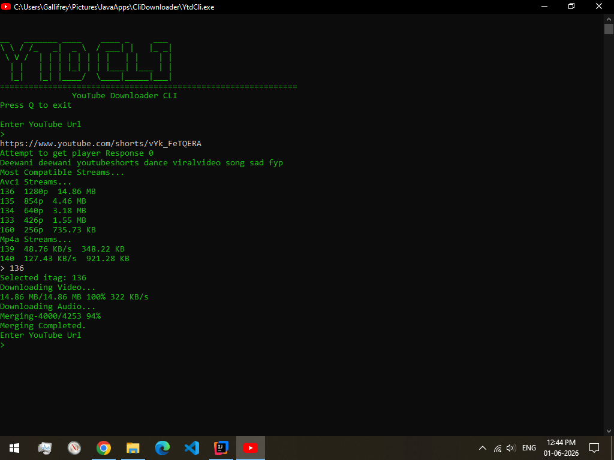

# YtDownloaderKotlinCli

Kotlin command-line tool to download audio and video (YouTube). This repository contains a Gradle-based CLI app.

## Requirements
- JDK 11 or newer
- Git (optional)
- Gradle wrapper is included (no global Gradle required)

## Build
Run nativeCompile to compile to exe directly

## Run
Use the Gradle run task during development:
  .\gradlew.bat run --args="<args>"

Or run the assembled jar after building (if configured):
  java -jar build\libs\<project>-all.jar

## Configuration
This project is designed to run on GraalVM (GraalVM JDK recommended).

Repository contains `config.properties` for runtime settings. Update any API keys or paths there before running.

Important: the CLI includes its own WebM/MP4 muxer implemented in-project and does not depend on external tools like `ffmpeg`. You don't need ffmpeg installed to use this tool.

## Project layout
- src/ — Kotlin source
- audio/ — audio output samples
- video/ — video output samples
- build.gradle.kts — build configuration

## Screenshots
Screenshots of the app are in the screenshots/ directory. Add images there and reference them in the README like:

## Contributing
Open issues or PRs. Keep changes small and document behavior.

## License
No license specified in the repository.
